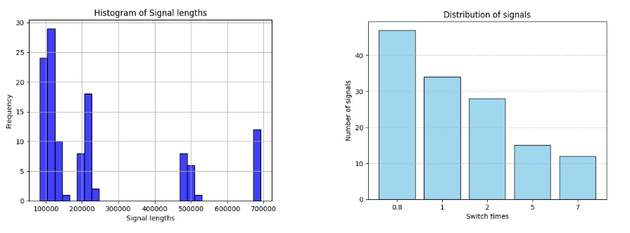
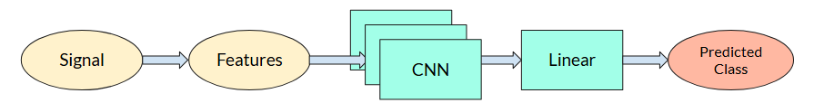
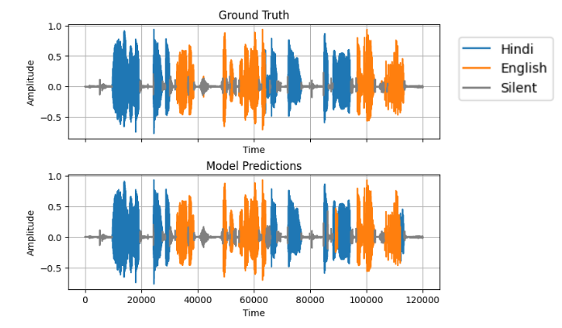
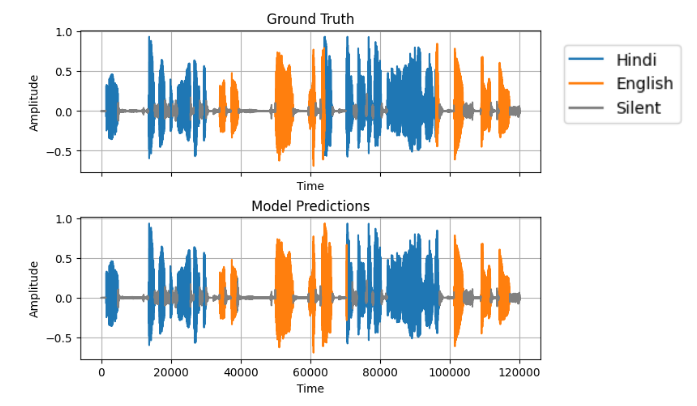
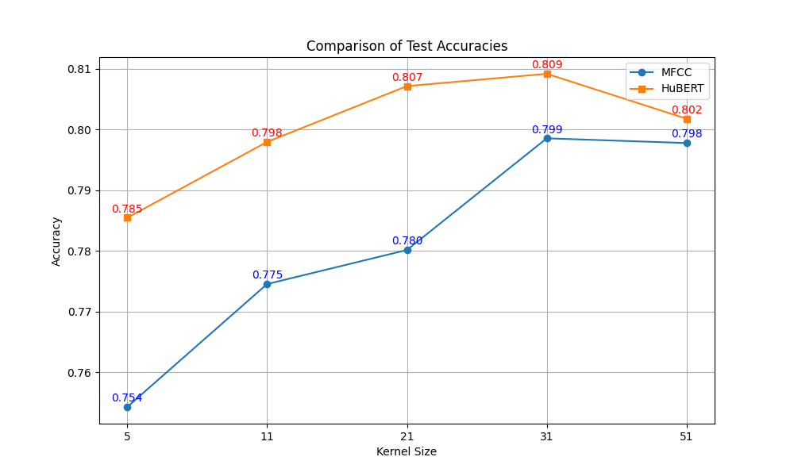

# Language Diarization
The aim of this project is to study various statistical and neural approaches for language diarization of Hindi-English code-switched speech. This is a course project for the course EE6307: Speech Systems offered by Prof. K Sri Rama Murty at IIT Hyderabad. This project was developed by
- [Ankit Saha](https://github.com/Ankit-Saha-2003)
- [Pranav Balasubramanian](https://github.com/Pranavb060504)

## Problem Statement
Language diarization is the process of automatically labeling and segmenting the languages in a speech signal that contains multiple languages. This is useful in multilingual settings, where speakers frequently code-switch between languages within a single conversation. Existing ASR systems perform better with language-specific models. Thus, there is a need to detect the languages present in different segments of a speech signal before passing it to an ASR. The signal has to be split into overlapping frames and the language identification has to be performed on each frame.

## Dataset 
We have used the [Synthetic Code-Switched Hindi-English Dataset](https://github.com/jagabandhumishra/Synthetic-cdsw-data/tree/master) generated by [Jagabandhu Mishra](https://github.com/jagabandhumishra) from the Speech Processing Lab, IIT Dharwad. This dataset consists of synthetically permuted segments of Hindi and English speech of the same speaker with different switch periods. Each signal consists of 5 language switch points. We had to manually listen to the audio files to find out the starting language in the signal, and then we used the switch periods to annotate the rest of the signal into Hindi or English.

  

## Approaches
We also performed voice activity detection (VAD) to annotate the silent regions in the speech signals. Now, we treated the language diarization task as a 3-class classification problem, with the classes being Hindi, English and Silent. All signals were zero-padded to ensure that they are of the same length before passing it to a neural network. The zero-padded regions are also annotated as Silent. We tried the following approaches. More details, including detailed results, can be found in our slides.
- Statistical
  - GMM
  - GMM-UBM
- Neural
  - [MFCC](https://librosa.org/doc/main/generated/librosa.feature.mfcc.html) features + CNN classifier
  - [HuBERT](https://huggingface.co/docs/transformers/en/model_doc/hubert) features + CNN classifier
 

  

The statistical approaches perform a frame-by-frame classification independently, by fitting separate GMMs for the MFCC features for each language. During inference, MFCC features are computed for the test signal and the likelihoods of it coming from either language are compared. This performs poorly, likely due to the fact that there is no contextual information used for predicting the language of a frame. A language is often characterized by particular phoneme and syllable transitions longer than a frame, which cannot be captured by such GMM models. 

This led to our idea of using a CNN classifier, which takes the entire signal as input and outputs a sequence of labels. Note that in this case, contextual information is being used within a context window for making each prediction, quantified by the kernel size of the CNN. The CNN consists of two size-preserving 1D convolutional layers with 128 and 256 channels respectively and kernel size 21 with ReLU activation. The CNN’s weights are trained using the cross-entropy loss over 3 classes (Hindi, English, Silent). We used two different ways of extracting speech features from the signal before passing to the CNN: MFCC and HuBERT. 
- For MFCC features, we chose a window length of 25 ms and a hop length of 20 ms. We then computed 13-dimensional MFCCs along with its velocity and acceleration coefficients. CMVN was also performed to remove channel and noise effects. Thus, we got **39-dimensional** features for each frame in the signal.
- For HuBERT features, we used the [facebook/hubert-base-ls960 model](https://huggingface.co/docs/transformers/en/model_doc/hubert) from the HuggingFace Transformers library. Internally, HuBERT uses a window length of 25 ms and a hop length of 20 ms for framing the signal and outputs **768-dimensional** features for each frame in the signal. Since HuBERT’s architecture consists of attention layers, the embeddings themselves are capturing contextual information too.

## Results
Statistical approaches for 2-class classification (Hindi, English)

  
| Approach | Accuracy |
|----------|----------|
| GMM      | 64.59%   |
| GMM-UBM  | 55%      |

Neural approaches for 3-class classification (Hindi, English, Silent)
| Approach | Accuracy including padding | Accuracy excluding padding
|----------|----------|----------|
| MFCC + CNN     | 92.90%   | 78.02% |
| HuBERT + CNN  |  93.77%  | 80.71%  |

#### Example of MFCC + CNN predictions

#### Example of HuBERT + CNN predictions

## Effect of Kernel Size
- We also investigated the effect of kernel size on the performance of these models
- The kernel size determines the context window (the number of neighbouring frames taken into consideration)
- We observed that increasing the kernel size improves the performance upto a point, beyond which it deteriorates
- This is expected because a kernel size too small does not have enough context
- If the kernel size is too large, the context ends up including frames of different languages
- We can also observe that HuBERT features consistently outperform MFCC features as expected

  

## References
1. [Mishra, Jagabandhu & Agarwal, Ayush & Prasanna, S. (2021). Spoken Language Diarization Using an Attention based Neural Network. 10.1109/NCC52529.2021.9530035.](https://www.researchgate.net/publication/352223715_Spoken_Language_Diarization_Using_an_Attention_based_Neural_Network)
2. [Hsu, Wei-Ning & Bolte, Benjamin & Tsai, Yao-Hung & Lakhotia, Kushal & Salakhutdinov, Ruslan & Mohamed, Abdelrahman. (2021). HuBERT: Self-Supervised Speech Representation Learning by Masked Prediction of Hidden Units. IEEE/ACM Transactions on Audio, Speech, and Language Processing. PP. 1-1. 10.1109/TASLP.2021.3122291.](https://ieeexplore.ieee.org/abstract/document/9585401?casa_token=K1sbxfRn1A0AAAAA:mJybbty6rFUu0zShEPkOtk_kpVJ_VoOd9ZIafZbDPNqbd2LRSyhBoeiUF4G6JwqcOwqWntKZro8qKg)
3. [Mishra, Jagabandhu. Synthetic Code-Switched Hindi-English Dataset.](https://github.com/jagabandhumishra/Synthetic-cdsw-data)
4. [GMM (scikit-learn)](https://scikit-learn.org/dev/modules/generated/sklearn.mixture.GaussianMixture.html)
5. [MFCC (Librosa)](https://librosa.org/doc/main/generated/librosa.feature.mfcc.html)
6. [HuBERT (HuggingFace Transformers)](https://huggingface.co/docs/transformers/en/model_doc/hubert)
